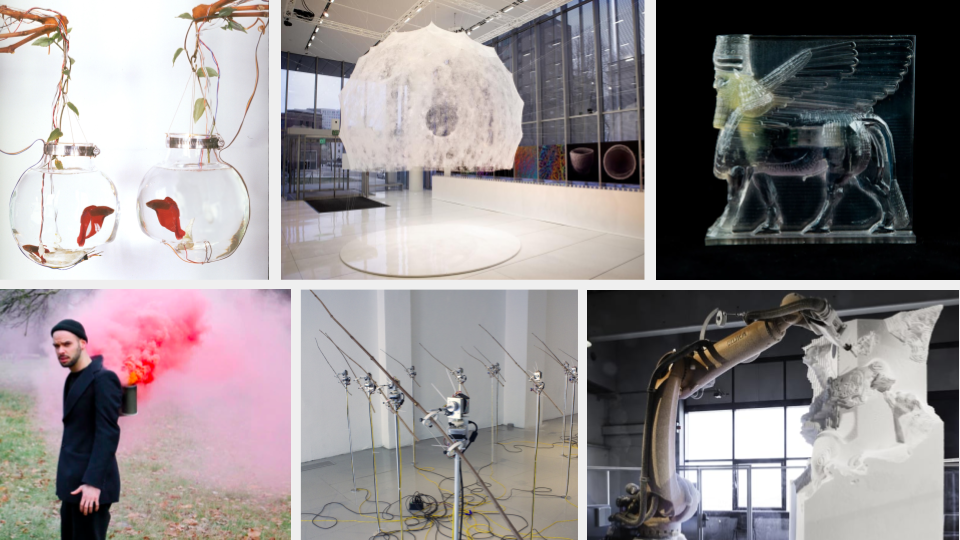

# EMAR 391-007: Digital Fabrication and Physical Computing - Fall 2021

[Description](#description) | [Schedule](#schedule) | [Resources](#resources) | [Grading](#grading) | [Policies](#policies) | [Accomodations](#accommodations-for-students-with-disabilities) | [References](#references)

*Clockwise from top left: [Ken Rinaldo - Mediated Encounters](https://www.kenrinaldo.com/portfolio/mediated-encounters/); [MIT Mediated Matter Group - Silk Pavillion](https://www.media.mit.edu/projects/silk-pavilion/overview/); [Morehshin Allahyari - Material Spectulation](http://www.morehshin.com/material-speculation-isis/); [Quayola - Carvings](https://www.cnn.com/style/article/davide-quayola-laocoon-robot-sculpture-smart-creativity/index.html); [David Bowen - Space Junk](https://www.dwbowen.com/spacejunk); [James Loh - Amae Apparatus](https://process.jonas-loh.com/post/7800652708/intimateethnography-title-amae-apparatus)*

# Description

This course introduces physical computing and digital fabrication for emerging media arts. We cover 3d scanning and photogrammetry; 3d modeling and computer aided design; rapid prototyping and digital fabrication; sensors, actuators, and embedded microcontrollers; creating workflows that move from analog to digital to analog. We explore these techniques through arts topics including wearable technologies, mechatronic automation, and approaches including Systems Art, Generative Art, Cybernetic Art and more. Class activities are contextualized through the history of emerging technology and media arts practice.

## Details

- **Instructor:** Dr. Robert Twomey
- **Class:** Thursday 12:30-3:15pm
- **Location:** Fabrication Lab / Student Lounge
- **Office Hours:** TBD, Wednesday pm, Discord, and in person.

## Course objectives
-	Experiential learning.
-	To gain a working understanding of 3d modeling software and 3d capture, as ways to create and manipulate form on a computer. 
-	To become familiar with digital fabrication workflow: the steps to get from 3d models and digital designs to physical objects.
-	To learn principles of hardware interaction and fundamentals of sensors and actuators.
-	To gain experience with hardware and digital fabrication as means of creative production.
-	To learn the fundamentals of safe equipment operation and maintenance for all processes introduced in class. 

A student who successfully completes this course will:
-	Be able to design physical forms with a variety of 3d modeling and digital capture technologies. 
-	Be able to fabricate functional objects with a variety of rapid prototyping and digital fabrication processes. 
-	Be able to design and construct projects using a variety of 3d modeling, digital, and material processes.
-	Have a working knowledge of projects and practitioners employing digital fabrication and hardware techniques.
-	Demonstrate a satisfactory ability to critique and engage in a discussion about creative work employing digital fabrication and hardware-based interaction.
-	Be able to think critically about computer-aided design and fabrication methods and relate them to historical art methods.

**Prequisites:** Major in Emerging Media Arts and successful completion of EMAR161 Computational Media Studio II, or permission of instructor.

# Schedule
(Subject to Change-Always check back for most up to date information)

| Date | Topic |
|------|-------|
| 8/26 | [Week 1 - Introduction, Overview - Digital Fabrication and Physical Computing](sessions/week1.md)|
|  | - [Introductory Exercise / Stencil (ex1)](exercises/ex1.md) |
| 9/2 | [Week 2 - CAD, 3D Modeling; Designing 2D and 3D Form](sessions/week2.md) |
| | - [Digital Double / Virtual Replica (ex2)](exercises/ex2.md), Introduce Sketchbook |
| 9/9 | [Week 3 - Laser Cutter; 2D Digifab](sessions/week3.md) |
| | - [Flatpack Future (ex3)](exercises/ex3.md)|
| 9/16 | [Week 4 - Stacked Contours; Slices; 3D Forms; Mesh Editing](sessions/week4.md) |
| | - ~Stacked Construction (ex4)~ |
| 9/23 | Week 5 - Re-Editing and Making Real: Slicing, 3DP; Photogrammetry and 3d Scanning; |
| | - Real World to Digital and Back (ex4) or Hybrid Object (ex5), assign Project 1: Digital Sculpture  |
| 9/30 | Week 6 - Microcontrollers and Digital I/O |
| | - Project 1 Due, Meaningful Signal (ex6) |
| 10/7 | Week 7 - Analog Input and Output; Analog Sensors |
| | - “Even Thermostats Can Be Said to Have Feelings” (ex7) |
| 10/14 | Week 8 - Making Things Move: Servos and Actuators |
| | - Biomimicry (ex8) |
| 10/21 | Week 9 - DC Motors, Solenoids; Linkages and Mounts |
| | - ____________ exercise (ex9), assign Project 2: Autonomous Artwork |
| 10/28 | Week 10 - Steppers, CNC, Mechatronics |
| | - Simple Coordinated Motion (ex10) |
| 11/4 | Week 11 - Smart Textiles; Digital Craft |
| | - Project 2 Due, High/Low Tech (ex11) |
| 11/11 | Week 12 - Wearables: Embodied Interface; Augmentation, Prosthesis |
| | - Somatic Interface (ex12), assign Project 3: Data Body |
| 11/18 | Week 13 - Internet of Things: Networked Objects, Spimes |
| | - Objects with Memories (ex13) |
| 11/25 | Week 14 - THANKSGIVING HOLIDAY (MEET ONLINE?) - Embodied Technologies: Somatic Interface; Hardware Performance|
| | - “The Pleasure of Being the Cause” (ex14) |
| 12/2 | Week 15 - Workshopping Final Presentations |
| | - Project 3 Due, Exhibition/Showcase Open Studios |
| 12/9 | Week 16 - (Final Project Documentation due, Talk) NO FINAL EXAM |

# Resources
- **Discussion:** we will use discord for discussion on the Carson Center server [https://discord.gg/QBkMgHW8](https://discord.gg/QBkMgHW8)
- **Canvas:** this is where I will handle formal announcements, grading, class business: [https://canvas.unl.edu/courses/114938](https://canvas.unl.edu/courses/114938)

# Grading

## Graded activities
- 30% Weekly Exercises – approximately 14 exercises
- 60% Projects – 3 total at approximately 20% each
- 10% Participation

Work will be evaluated on the quality of concept, the degree of experimentation (both aesthetic and technical), and final realization (again, aesthetic and technical). Prompts and rubrics will be provided with more specific details regarding each assignment and breakdowns

## Description of Assignments and Exams

__*Weekly Exercises*__
We will have regular, weekly programming assignments employing the tools and techniques covered in class. These will be short activities with clearly stated creative prompts and technical requirements. Projects will be graded on satisfactory completion with additional credit for creative, technical, expressive extension beyond requirements. 

__*Projects*__
We will have three projects over the semester with the following aims: Project 1 covers digital fabrication and analog and computer mediated processes. Project 2 covers physical computing, interactivity, and mechatronic/automated systems. Project 3 covers wearables and embodied technologies. For each project students will submit a project archive containing a statement of concept, source code, links to data resources, documentation of the work, discussion of results, and future directions. When assigned, students will submit a proposal/concept for their project to receive instructor feedback, and then work to complete the project. Projects will be presented and critiqued in class and project archives will be submitted for grading.

__*Participation*__
Contributions to class discussions and active participation in small group work are essential to both the momentum of the course and the development of your ideas. This requires that you come to class prepared (having completed assigned reading and writing) and ready to participate in class activities. This course is based on collaborative, project-based learning and you are also expected to contribute as a responsible member of a group. See the participation evaluation in the Grading Scale below for more information.

## Attendance
On-time attendance is required as well as playtesting inside and outside of section. Please notify your instructor in advance if you must be absent for illness or family emergency. Any absences must be cleared with the instructor, or justified with written documentation (e.g. letter from team, etc.). We do not differentiate between mental and physical health and in either case please be in communication for when you need to take a day off. After a student misses a week’s worth of classes each subsequent missed class will result in the reduction of the final grade by a full letter grade (i.e., A to B, B- to C-) Excessive tardiness or leaving early will also impact your grade and will follow the same rubric.

Please also note the JCSTF attendance policy:
- 4.7 Attendance Policy
- 4.7.1 After a student misses an equivalent of one week’s worth of classes, each subsequent missed
class will result in the reduction of the final grade by a full letter grade (i.e., A to B, B- to C-).
- 4.7.2 Students may be granted an excused absence at the instructor’s discretion.
- 4.7.3 Students may be granted an excused absence, at the instructor’s discretion, to allow those students to participate in extra-curricular events representing the University. In such cases, the instructor must be notified in advance.
- 4.7.4 This policy, as approved by the faculty, represents the minimum requirement. Faculty members are permitted to develop more stringent attendance requirements, as long as those requirements are detailed in writing in the class syllabus and distributed at the beginning of each course.
- 4.7.5 The policy on students who are late to class will be left up to the individual instructors.

## Late work policy
Students can submit one assignment (exercise or peer review) late without penalty. Any following late assignments will be docked 5% for each day they are late (if an assignment is two days late, the grade will be docked 10%).

Due to COVID-19 and current community health concerns, I will make exceptions for illness with documentation. 

## Grading Scale
|      |     |     |
| ---- | ---- | ---- |
| A+ = 97-100 | A = 93-96 | A- = 90-92 |
| B+ = 87-89 | B = 83-86 | B- = 80-82 |
| C+ = 77-79 | C = 73-76 | C- = 70-72 |
| D+ = 67-69 | D = 63-66 | D- = 60-62 |
| F =below 60% | | |

Here is a description of the kind of participation in the course that would earn you an A, B, C, etc. Your instructor may use pluses and minuses to reflect your participation more fairly, but this is a general description for each letter grade.

A – Excellent
Excellent participation is marked by near-perfect attendance and rigorous preparation for class. You respond to questions and activities with enthusiasm and insight and you listen and respond thoughtfully to your peers. You submit rough drafts on time, and these drafts demonstrate a thorough engagement with the assignment. You respond creatively to the feedback you receive (from both your peers and instructors) on drafts, making significant changes to your writing between the first and final drafts that demonstrate ownership of your own writing process. Finally, you are an active contributor to the peer- review and collaborative writing/making processes.

B – Good
Good participation is marked by near-perfect attendance and thorough preparation for discussion section. You respond to questions with specificity and make active contributions to creating a safe space for the exchange of ideas. You submit rough drafts on time, and these drafts demonstrate thorough engagement with the assignment. You respond effectively to the feedback you receive (from both your peers and instructor) on drafts, making changes to your work between the first and final drafts. You are a regular and reliable contributor to the peer-review and collaborative writing/making processes.

C – Satisfactory
Satisfactory participation is marked by regular attendance and preparation for class. You respond to questions when prompted and participate in classroom activities, though you may sometimes be distracted. You are present, with few absences, and have done some of the reading some of the time. You submit drafts on time and make some efforts toward revision between the first and final drafts of an assignment. You are involved in peer-review activities, but you offer minimal feedback and you may not always contribute fully to the collaborative writing/making process.

D – Unsatisfactory
Unsatisfactory participation is marked by multiple absences from section and a consistent lack of preparation. You may regularly be distracted by materials/technology not directly related to class. You submit late or incomplete work and revise minimally or only at a surface level between drafts. You are absent for peer-review activities, offer unproductive feedback, or do not work cooperatively in collaborative environments.

F—Failing
Failing participation is marked by excessive absences, a habitual lack of preparation, and failure to engage in the drafting, revision, and collaborative writing/making processes.

## Academic Honesty Policy

Academic dishonesty will not be tolerated in this course. Any instances will result in an automatic grade of F in the course and possible disciplinary action under the Student Code of Conduct (https://studentconduct.unl.edu/student-code-conduct). For information on the University’s policy on academic dishonesty, please refer to the current Undergraduate Bulletin (https://registrar.unl.edu/academic-honesty).

We will use many open source projects to make our work. It is ok to use others' code. However, **you need to cite your sources**, and **you need to do transformative work/make it your own**.

# Policies

## Accommodations for Students with Disabilities
Students with disabilities are encouraged to contact their instructor for a confidential discussion of their individual needs for academic accommodation based on a current accommodation plan. It is the policy of the University to provide flexible and individualized accommodations to students with documented disabilities including those students with mental health disabilities such as depression and anxiety. To receive reasonable accommodation, students must be registered with the Services for Students with Disabilities (SSD) office, 117 Louise Pound Hall, 402-472-3787 V/TTY.

## Mental Health and Wellbeing Resources
UNL offers a variety of options to students to aid them in dealing with stress and adversity. Counseling and Psychological & Services (CAPS) is a multidisciplinary team of psychologists and counselors that works collaboratively with Nebraska students to help them explore their feelings and thoughts and learn helpful ways to improve their mental, psychological and emotional well- being when issues arise. CAPS can be reached by calling 402-472-7450. Big Red Resilience & Well- Being provides one-on-one well-being coaching to any student who wants to enhance their well- being. Trained well-being coaches help students create and be grateful for positive experiences, practice resilience and self-compassion, and find support as they need it. BRRWB can be reached by calling 402-472-8770.

## COVID-19 face covering policy

To protect the health and well-being of the University and wider community, UNL has implemented 
a policy requiring all people, including students, faculty, and staff, to wear a face covering that 
covers the mouth and nose while on campus. The classroom is a community, and as a community, 
we seek to maintain the health and safety of all members by wearing face coverings when in the 
classroom. Failure to comply with this policy is interpreted as a disruption of the classroom 
and may be a violation of UNL’s Student Code of Conduct.
  
Individuals who have health or medical reasons for not wearing face coverings should work with 
the Office of Services for Students with Disabilities (for students) or the Office of Faculty/Staff 
Disability Services (for faculty and staff) to establish accommodations to address the health 
concern. Students who prefer not to wear a face covering should work with their advisor to arrange 
a fully online course schedule that does not require their presence on campus.
  
Students in the classroom:

1. If a student is not properly wearing a face covering, the instructor will remind the student of the policy and ask them to comply with it.

2. If the student will not comply with the face covering policy, the instructor will ask the student to leave the classroom, and the student may only return when they are properly wearing a face covering.

3. If the student refuses to properly wear a face covering or leave the classroom, the instructor will dismiss the class and will report the student to Student Conduct & Community Standards for misconduct, where the student will be subject to disciplinary action.
  

Instructors in the classroom:

1. If an instructor is not properly wearing a face covering, students will remind the instructor of the policy and ask them to comply with it.

2. If an instructor will not properly wear a face covering, students may leave the classroom and should report the misconduct to the department chair or via the TIPS system for disciplinary action through faculty governance processes.

 
*Courses that have been granted an exception to the Face Covering Policy for pedagogical 
reasons are excluded. Exceptions to the Face Covering Policy are only granted after an 
approved health safety plan is developed

<!--An individual in this course has a documented need for face coverings to be required in this course. Without divulging personal or identifying information, such a documented need might be that a member of their household is unable to be vaccinated or has a health condition that makes vaccines less effective for them. As a result, the Hixson-Lied College of Fine and Performing Arts has determined that face coverings will be required in this course. If you are unwilling to comply with this requirement, please visit with your advisor about different sections or possible alternative courses that you might take in lieu of this one.-->

# Land Acknowledgment

We acknowledge that the University of Nebraska is a land-grant institution with campuses and programs on the past, present, and future homelands of the Pawnee, Ponca, Oto-Missouria, Omaha, Dakota, Lakota, Arapaho, Cheyenne, and Kaw Peoples, as well as the relocated Ho-Chunk, Iowa, and Sac and Fox Peoples. Please take a moment to consider the legacies of more than 150 years of displacement, violence, settlement, and survival that bring us together here today. This acknowledgement and the centering of Indigenous Peoples is a start as we move forward together for the next 150 years. 
