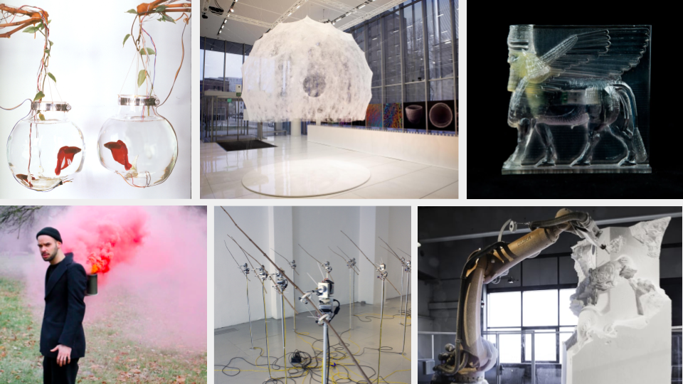

# EMAR 246: Digital Fabrication and Physical Computing - Fall 2026

[Description](#description) | [Resources](#resources) | [Schedule](#schedule) | [Grading](#grading) | [Policies](#policies) | [References](#references)

*Clockwise from top left: [Ken Rinaldo - Mediated Encounters](https://www.kenrinaldo.com/portfolio/mediated-encounters/); [MIT Mediated Matter Group - Silk Pavillion](https://www.media.mit.edu/projects/silk-pavilion/overview/); [Morehshin Allahyari - Material Spectulation](http://www.morehshin.com/material-speculation-isis/); [Quayola - Carvings](https://www.cnn.com/style/article/davide-quayola-laocoon-robot-sculpture-smart-creativity/index.html); [David Bowen - Space Junk](https://www.dwbowen.com/spacejunk); [James Loh - Amae Apparatus](https://process.jonas-loh.com/post/7800652708/intimateethnography-title-amae-apparatus)*

# Description

This course introduces digital fabrication and physical computing for emerging media arts. We cover 3d modeling and computer aided design; 3d scanning and photogrammetry; rapid prototyping and digital fabrication; sensors, actuators, and embedded microcontrollers; creating workflows that move from analog to digital to analog. We explore these techniques through arts topics including wearable technologies, mechatronic automation, and approaches including Systems Art, Generative Art, Cybernetic Art and more. Class activities are contextualized through the history of emerging technology and media arts practice. Each session begins with hands-on equipment training at Nebraska Innovation Studio, followed by lecture and demonstration.

## Details

- **Instructor:** Dr. Dan "NovySan" Novy
- **TA:**
- **Class:** M/W 15:00-17:20 (3:00PM-5:20PM) CT
- **Location:** Nebraska Innovation Studio
- **Office Hours:** By appointment, Discord, and in person (CEMA 253)

## Course objectives
-	Experiential learning.
-	To gain a working understanding of 3d modeling software and 3d capture, as ways to create and manipulate form on a computer. 
-	To become familiar with digital fabrication workflow: the steps to get from 3d models and digital designs to physical objects.
-	To learn principles of hardware interaction and fundamentals of sensors and actuators.
-	To gain experience with hardware and digital fabrication as means of creative production.
-	To learn the fundamentals of safe equipment operation and maintenance for all processes introduced in class. 

A student who successfully completes this course will:
-	Be able to design physical forms with a variety of 3d modeling and digital capture technologies. 
-	Be able to fabricate functional objects with a variety of rapid prototyping and digital fabrication processes. 
-	Be able to design and construct projects using a variety of 3d modeling, digital, and material processes.
-	Have a working knowledge of projects and practitioners employing digital fabrication and hardware techniques.
-	Demonstrate a satisfactory ability to critique and engage in a discussion about creative work employing digital fabrication and hardware-based interaction.
-	Be able to think critically about computer-aided design and fabrication methods and relate them to historical art methods.

**Prerequisites:** Major in Emerging Media Arts and successful completion of EMAR161 Computational Media Studio II, or permission of instructor.

# Resources
- **Discord:[https://discord.com/channels/688079641738608705/1523135576658804866](https://discord.com/channels/688079641738608705/1523135576658804866)**
- **Canvas:[https://mynu.instructure.com/courses/14084](https://mynu.instructure.com/courses/14084)**
- **[Rhino 3d](https://www.rhino3d.com/)**
- **[Grasshopper (included in Rhino 8)](https://www.grasshopper3d.com/)**
- **[Prusa Slicer](https://help.prusa3d.com/downloads)**
- **[Muse laser cutter in student makerspace](https://fslaser.com/laser-101/)**
- **[Innovation Studio](https://make.unl.edu/)**
- **[Adafruit](https://www.adafruit.com/)**
- **[DFRobot](https://www.dfrobot.com/)**
- **[Arduino Store](https://store.arduino.cc/)** 

# Schedule
(Subject to change. Check back for most up to date information)

| Week | Topic |
|------|-------|
| 1a | **[Intro and Overview](sessions/week1.md#monday)** Course Policies; Install Rhino; Rhino basics; Sign up for Discord |
| 1b | **[Laser Cutter](sessions/week1.md#wednesday)** More Rhino basics; 2D Drawing; Exercise: Stencil and Digital Notebook |
| 2a | **[Tab and Slot](sessions/week2a.md)** |
| 2b | **[Laser to 3D: Stacked Contours](sessions/week2b.md)** |
| 3a | **[Labor Day - No Class](sessions/week3a.md)** |
| 3b | **[Mesh Creation and Contour Extraction](sessions/week3b.md)** |
| 4a | **[Shopbot and Large CNC](sessions/week4a.md)** |
| 4b | **[Molding and Casting](sessions/week4b.md)** |
| 5a | **[Vacuum-Forming and Kitbashing](sessions/week5a.md)** |
| 5b | **[Work Day](sessions/week5b.md)** |
| 6a | **[Intro to 3D Printing](sessions/week6a.md)** |
| 6b | **[Desktop Injection Molding; Critique Project 1](sessions/week6b.md)** |
| 7a | **[Formlabs & Stratasys Hands-On](sessions/week7a.md)** |
| 7b | **[Inflatables](sessions/week7b.md)** |
| 8a | **[Digitizing Objects: 3D Scanning and Photogrammetry](sessions/week8a.md)** |
| 8b | **[Scanning Spaces](sessions/week8b.md)** |
| 9a | **[Fall Break - No Class](sessions/week9a.md)** |
| 9b | **[Work Day - Halloween project build](sessions/week9b.md)** |
| 10a | **[Work Day - final build push](sessions/week10a.md)** |
| 10b | **[Critique Project 2](sessions/week10b.md)** |
| 11a | **[Making Things Move](sessions/week11a.md)** |
| 11b | **[Making Things Move II](sessions/week11b.md)** |
| 12a | **[Arduino Analog](sessions/week12a.md)** |
| 12b | **[Sensors and Inputs](sessions/week12b.md)** |
| 13a | **[Actuators and Outputs](sessions/week13a.md)** |
| 13b | **[How to Build a Hardwall Flat](sessions/week13b.md)** |
| 14a | **[SANITY CHECK](sessions/week14a.md)** |
| 14b | **[Thanksgiving - No Class](sessions/week14b.md)** |
| 15a | **[Final Project Work](sessions/week15.md#monday)** |
| 15b | **[Final Project Work](sessions/week15.md#wednesday)** |
| 16a | **[Final Project Work](sessions/week16.md#monday)** |
| 16b | **[Final Project Work](sessions/week16.md#wednesday)** |
| 16c | **[Open Studios at the Carson Center – Final Critique](sessions/week16.md#friday)** |
| Finals Week| Submit Final Documentation to Canvas and Sketchbook by Friday, December 18, 2026 |

## Live Schedule (Production2026)

<iframe src="https://docs.google.com/spreadsheets/d/e/2PACX-1vT3JH2et6ZT8Dd3aRJDq9hZCdI_eu3syb7DNP-79VkAsDEX8glswYN6VCyziIpZrGCoZs7G4dGQKhlx/pubhtml?gid=1155642700&amp;single=true&amp;widget=true&amp;headers=false" width="100%" height="800" style="border:0;"></iframe>

# Grading

## Graded activities
- 30% Exercises – approximately 8 exercises
- 60% Projects – 3 total at approximately 20% each
- 10% Participation

Work will be evaluated on the quality of concept, the degree of experimentation (both aesthetic and technical), and final realization (again, aesthetic and technical). Prompts and rubrics will be provided with more specific details regarding each assignment and breakdowns

## Description of Assignments and Exams

__*Exercises*__
We will have regular, semi-regular assignments employing the tools and techniques covered in class. These will be short activities with clearly stated creative prompts and technical requirements. Projects will be graded on satisfactory completion with additional credit for creative, technical, expressive extension beyond requirements. 

__*Projects*__
We will have three projects over the semester due approximately every 5 weeks. Project 1 covers digital fabrication and analog and computer mediated processes. Project 2 covers physical computing, interactivity, and mechatronic/automated systems. Project 3 covers wearables and embodied technologies. For each project students will submit a project archive containing a statement of concept, source code, links to data resources, documentation of the work, discussion of results, and future directions. When assigned, students will submit a proposal/concept for their project to receive instructor feedback, and then work to complete the project. Projects will be presented and critiqued in class and project archives will be submitted for grading.

__*Participation*__
Contributions to class discussions and active participation in small group work are essential to both the momentum of the course and the development of your ideas. This requires that you come to class prepared (having completed assigned reading and writing) and ready to participate in class activities. This course is based on collaborative, project-based learning and you are also expected to contribute as a responsible member of a group. See the participation evaluation in the Grading Scale below for more information.

## Late work policy
An assignment may receive an F if a student does not participate in every phase of the development of the project and meet all deadlines for preliminary materials (proposals, drafts, etc.). Failure to submit any of the graded course assignments is grounds for failure in the course. If a final draft or project, plus required addenda, is not submitted in class on the date due, it will be considered late and will lose one letter grade (at my discretion) for each day or part of a day past due (A to B, etc.). Assignments are due via Canvas (online assignment) as well as bringing your prototype to class. Any late submissions must be approved by your faculty instructor well in advance of the due date.

## Grading Scale

Default Canvas Grading Scheme:

A = 100% to 94% | A- = < 94% to 90%  
B+ = < 90% to 87% | B = < 87% to 84% | B- = < 84% to 80%  
C+ = < 80% to 77% | C = < 77% to 74% | C- = < 74% to 70%  
D+ = < 70% to 67% | D = < 67% to 64% | D- = < 64% to 61%  
F = < 61% to 0% 

Here is a description of the kind of participation in the course that would earn you an A, B, C, etc. Your instructor may use pluses and minuses to reflect your participation more fairly, but this is a general description for each letter grade.

A – Excellent 
Excellent participation is marked by near-perfect attendance and rigorous preparation for class. You respond to questions and activities with enthusiasm and insight and you listen and respond thoughtfully to your peers. You submit rough drafts on time, and these drafts demonstrate a thorough engagement with the assignment. You respond creatively to the feedback you receive (from both your peers and instructors) on drafts, making significant changes to your writing between the first and final drafts that demonstrate ownership of your own writing process. Finally, you are an active contributor to the peer- review and collaborative writing/making processes.

B – Good 
Good participation is marked by near-perfect attendance and thorough preparation for discussion section. You respond to questions with specificity and make active contributions to creating a safe space for the exchange of ideas. You submit rough drafts on time, and these drafts demonstrate thorough engagement with the assignment. You respond effectively to the feedback you receive (from both your peers and instructor) on drafts, making changes to your work between the first and final drafts. You are a regular and reliable contributor to the peer-review and collaborative writing/making processes.

C – Satisfactory 
Satisfactory participation is marked by regular attendance and preparation for class. You respond to questions when prompted and participate in classroom activities, though you may sometimes be distracted. You are present, with few absences, and have done some of the reading some of the time. You submit drafts on time and make some efforts toward revision between the first and final drafts of an assignment. You are involved in peer-review activities, but you offer minimal feedback and you may not always contribute fully to the collaborative writing/making process.

D – Unsatisfactory 
Unsatisfactory participation is marked by multiple absences from section and a consistent lack of preparation. You may regularly be distracted by materials/technology not directly related to class. You submit late or incomplete work and revise minimally or only at a surface level between drafts. You are absent for peer-review activities, offer unproductive feedback, or do not work cooperatively in collaborative environments.

F—Failing 
Failing participation is marked by excessive absences, a habitual lack of preparation, and failure to engage in the drafting, revision, and collaborative writing/making processes.

# Policies

__UNL Course Policies and Resources__. Students are responsible for knowing the university policies and resources found on this page: [https://go.unl.edu/coursepolicies](https://go.unl.edu/coursepolicies)
- University-wide Attendance Policy
- Academic Honesty Policy
- Services for Students with Disabilities
- Mental Health and Well-Being Resources
- Final Exam Schedule
- Fifteenth Week Policy
- Emergency Procedures
- Diversity & Inclusiveness
- Title IX Policy
- Other Relevant University-Wide Policies

## Academic Honesty Policy

While we will adhere to the UNL Academic Honesty Policy linked above, we will use many open source projects to make our work. It is ok to use others' code. However, **you need to cite your sources**, and **you need to do transformative work/make it your own**.

## Attendance
On-time attendance is required as well as work inside and outside of section. Please notify your instructor in advance if you must be absent for illness or family emergency. Any absences must be cleared with the instructor, or justified with written documentation (e.g. letter from team, etc.). After a student misses a week’s worth of classes each subsequent missed class will result in the reduction of the final grade by a full letter grade (i.e., A to B, B- to C-) Three Unexcused Absences will be grounds for failure of the course. Excessive tardiness or leaving early will also impact your grade and will follow the same rubric.

Please also note the JCSTF attendance policy:
- 4.7 Attendance Policy
- 4.7.1 After a student misses an equivalent of one week’s worth of classes, each subsequent missed
class will result in the reduction of the final grade by a full letter grade (i.e., A to B, B- to C-).
- 4.7.2 Students may be granted an excused absence at the instructor’s discretion.
- 4.7.3 Students may be granted an excused absence, at the instructor’s discretion, to allow those students to participate in extra-curricular events representing the University. In such cases, the instructor must be notified in advance.
- 4.7.4 This policy, as approved by the faculty, represents the minimum requirement. Faculty members are permitted to develop more stringent attendance requirements, as long as those requirements are detailed in writing in the class syllabus and distributed at the beginning of each course.
- 4.7.5 The policy on students who are late to class will be left up to the individual instructors.

# References
<!--- Past courses: [UCSD ECE188 ML for the Arts 2019](https://roberttwomey.github.io/ucsd-ml-art/)-->

# Land Acknowledgment

We acknowledge that the University of Nebraska is a land-grant institution with campuses and programs on the past, present, and future homelands of the Pawnee, Ponca, Oto-Missouria, Omaha, Dakota, Lakota, Arapaho, Cheyenne, and Kaw Peoples, as well as the relocated Ho-Chunk, Iowa, and Sac and Fox Peoples. Please take a moment to consider the legacies of more than 150 years of displacement, violence, settlement, and survival that bring us together here today. This acknowledgement and the centering of Indigenous Peoples is a start as we move forward together for the next 150 years. 
