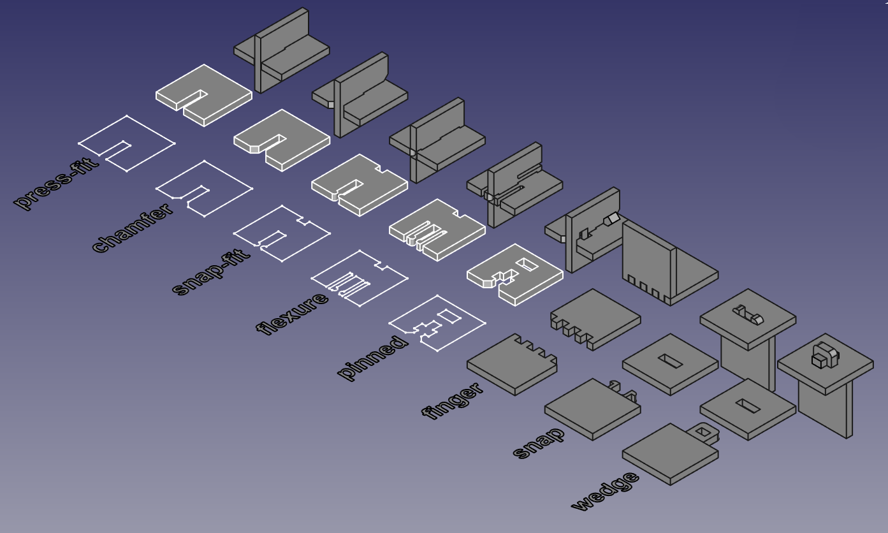
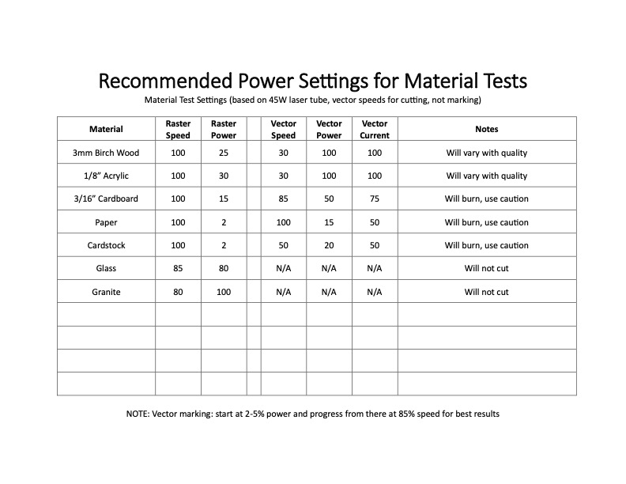

# Week 3b - Wednesday

## Wednesday

- Artist of the Day
- Tutorial
  - [Tab and Slot Construction](#tab-and-slot-construction)
  - [Measuring Thickness](#measuring-thickness)
  - [Matching Parts](#matching-parts)
  - [Living Hinge](#living-hinge)

### Artist of the Day 

Ben Butler

- [https://mymodernmet.com/ben-butler-organic-sculptures/](https://mymodernmet.com/ben-butler-organic-sculptures/)
- [https://www.benbutlerart.com](https://www.benbutlerart.com/)

### Tab and Slot Construction

[Watch Robert's excellent Tab and Slot video](https://drive.google.com/file/d/1vl3tXYDvtaKFR-5nZPMWjXdkxG93yDgn/view?usp=sharing)

1. How can we build 3d structure with 2d materials? 
2. Tab and slot construction? (also called finger joints)
3. You need to design 2d parts that have holes (slots), and other parts that have tabs, so that when cut from flat materials you can assemble them into 3d forms.
4. Optional: Extrude your designs to the thickness of the material, to make solides. Assemble these solides in Rhino to mock up your 3d form.
5. Reference (Video Tutorials):
   - Finger joint laser cut box: https://www.youtube.com/watch?v=FBSQGHBpBWg
   - Finger joint tutorial in Rhino with boolean operations: https://www.youtube.com/watch?v=AYxUUSWIRW4

### Measuring Thickness
- Using calipers. See [Sparkfun: How To Use Calipers](https://www.youtube.com/watch?v=73YJA5giZfs) (youtube link)
- Cutting tests. 

### Matching Parts
- [Line](https://docs.mcneel.com/rhino/7/help/en-us/index.htm#commands/line.htm)
- [Offset](https://docs.mcneel.com/rhino/7/help/en-us/index.htm#commands/offset.htm)
- [Trim](https://docs.mcneel.com/rhino/7/help/en-us/index.htm#commands/trim.htm)

### Example Two Slots

Rhino file: [two_slots.3dm](../examples/two_slots.3dm)

### Living Hinge
- Living hinge construction
  - [Kerf Bending Experiments:](https://web.archive.org/web/20221117232952/https://www.martin-breuer.com/kerf-bending-patterns)
  - [Lattice Hinge Design Workshop:](https://futurearchi.org/t/lattice-hinge-design-workshop-starting-from-an-open-source-grasshopper-design/576)
  - With grasshopper: [https://github.com/StDrunks/Living-Loop](https://github.com/StDrunks/Living-Loop)
  - [Kokopelli](https://makezine.com/article/workshop/kokopelli-quickstart-parametric-living-hinge/)

## Homework
- Start ideating for [Project 1](../projects/project1.md)

## References
- For your reference: [Rhino Learn](https://www.rhino3d.com/learn/?keyword=kind:%20rhino_win) (tutorials)
- [Sketchup to Rhino Cheatsheet](https://static1.squarespace.com/static/585ca81337c5816afcb8d981/t/5c7478b715fcc0b3c46366d7/1551136953876/Sketchup-Rhino+Cheat+Sheet.pdf)
- 

### Laser Cutter Reference
- Epilog:
- RetinaEngrave Software:
  - [quick reference guide](https://info.fslaser.com/hubfs/Public_Documents/RetinaEngrave%20v3.0%20RefGuide.pdf)  
  - [Video Tutorials](https://www.youtube.com/playlist?list=PL_1I1UNQ4oGa0w55C772Y1mC6F4f3ZcG6)
  - [RE3.0 Manual](https://info.fslaser.com/hubfs/Public_Documents/RetinaEngrave%20v3.0%20Manual.pdf)
- FSL Muse References:
  - [Muse 3D Manual](https://f.hubspotusercontent00.net/hubfs/2882208/MUSE_MANUAL.pdf)
  - FSL Muse specifications, safety documentation.

- [MIT's How to Make (Almost) Anything computer controlled cutting resources] (http://academy.cba.mit.edu/classes/computer_cutting/index.html)
- [FLAT FAB](http://flatfab.com/)
- [Cuttle](9https://cuttle.xyz/)

### Power Settings
- Suggested starting power settings for FSL Muse (do tests and adjust these for your project):

## Leftovers 
- Slicing / panelling tools (breaking 3d structure down into 2d components that can be assembled)
- Parametric design for kerfs and 3d structures (grasshopper)

